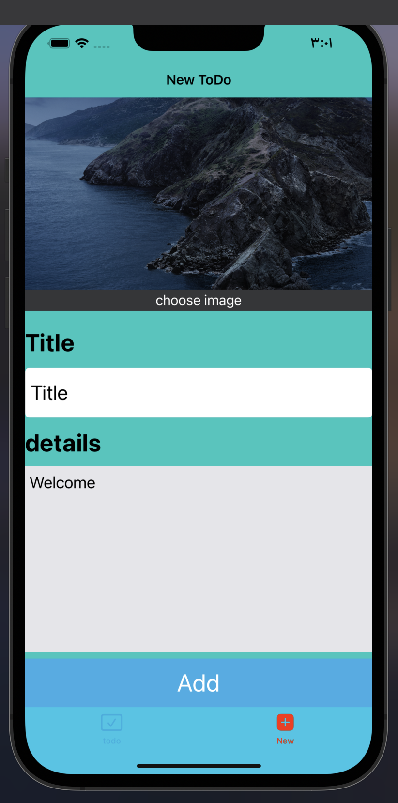
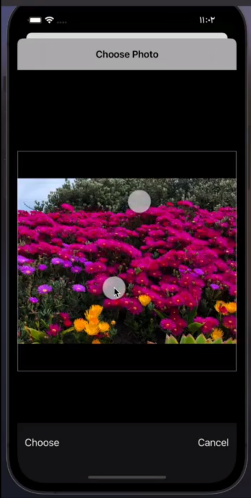
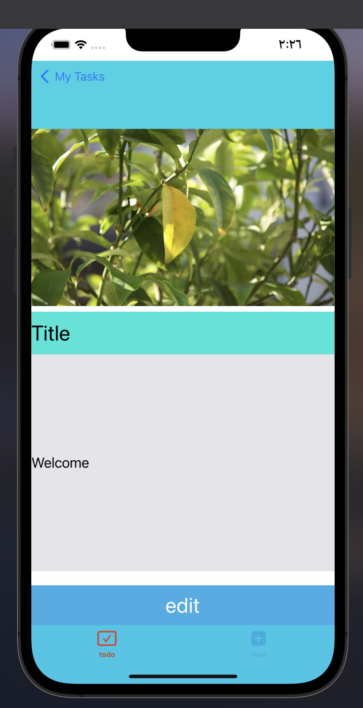
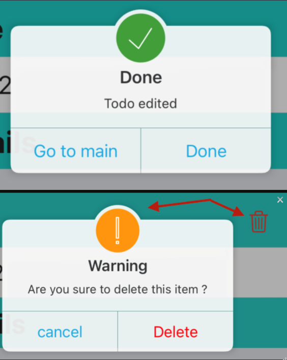

# Todo App

## 📹 Video Demo : [IOS Todo App](https://drive.google.com/file/d/1DCo3cnI2GQNp34akC2_CDeW3-XWSOGGW/view?usp=sharing)

## ✨ Features :

- 🔄 Core Data Integration for efficient data storage.
- 📝 CRUD Operations (Create, Read, Update, Delete) for managing tasks.
- 📲 Navigation Controller for seamless navigation between screens.
- 🌐 Alamofire integration for handling network requests.
- 🖼️ Pick image from gallery

## Technologies and Tools Used:

- 📱 Swift
- 📱 Storyboard
- 📱 CocoaPods
- 📱 UIKit
- 📱 Xcode

## 🏗️ Architecture: MVC

## 📸 Screenshots :

  
  

##